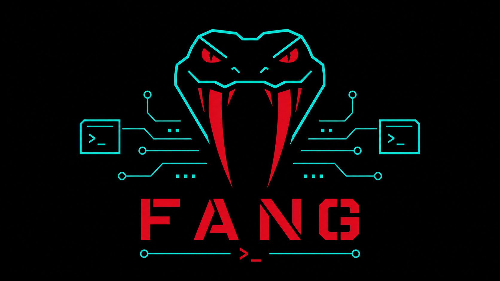

# Fang

### What is it?

- It's a hacker's dream or smth idk

### How to use this?

- `help`

### How to install?

- `cargo install fang-toolkit`

### Features:

| Task            | Priority | Status   |
| --------------- | -------- | -------- |
| Proxy Support   | High     | Not done |
| Scripting       | High     | Not done |
| Themes          | Low      | Not done |
| Port scan       | N/A      | Done     |
| Ping            | N/A      | Done     |
| Http operations | N/A      | Done     |
| Http crawler    | N/A      | Done     |
| Reverse TCP     | N/A      | Done     |
| Nice UI         | N/A      | Done     |

### License:

- Apache-2.0

### Community

<iframe src="https://discord.com/widget?id=1507077131346247810&theme=dark" width="350" height="500" allowtransparency="true" frameborder="0" sandbox="allow-popups allow-popups-to-escape-sandbox allow-same-origin allow-scripts"></iframe>

### Support me:

- `XMR` - `482wWwVZsBkbkYAgkGKMF8ZKRJ5Vt32jRS7MMNtoFuLpRtLRiHaxcbAMAid9LeevsGNwtX3NLoZ6b4inFWfGJ68sNUhck64`
- `LTC` - `LUC7qKa6n4SZ3g9h2iBhkiT9quNWvyR6YS`
